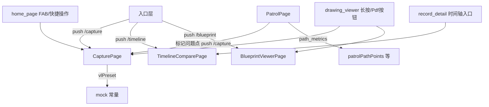

## 产品概述

补全工地验收 Flutter App 中 4 处未移植/占位功能，与 HTML 原型（gongdi/）交互等量对齐：

1. **拍照验收（P3）**：图钉选点 → 真实相机快门（image_picker）→ 扫描动画 → VL 识别（vlPreset 预设）→ 保存记录
2. **巡场轨迹动画（P5）**：开始/暂停/继续/结束状态机，圆点沿路径平滑移动 + 脉冲动画，分段轨迹逐段显现、检查点已过高亮、终点最后出现，实时里程/点数/时长统计
3. **时间轴对比（F8）**：同一部位多时点照片网格选两张，滑块拖动做前后裁剪对比
4. **PDF 原稿（P4）**：图纸 PNG 蓝图原稿全屏预览页（缩放 + 西楼1F/东楼1F/总平面图切换）

## 核心功能

- 拍照验收页：楼层图纸底图 + 预置照片锚点图钉 + 准星选点（关联最近锚点）、真实相机快门、1.5s 识别扫描动画、缺陷识别结果卡片（名称·严重度·置信度·已校验）、水印条（时间戳/GPS/海拔/楼层部位）、控制条（识别/加点/快门/重拍/标注）、保存记录；入口接入首页 FAB、首页快捷操作、图纸查看器长按锚定、巡场"标记问题点"
- 巡场页：深色沉浸主题，路径圆角折线 + 检查点 + 起终点，Ticker 驱动轨迹动画，统计 chips 实时更新（里程/点数/时长），标记问题点跳转拍照验收
- 时间轴对比页：锚点标题 + 3 时点照片网格（before/mid/after + 已校验徽标）+ 并排对比滑块裁剪；入口为记录详情页"时间轴对比"
- 蓝图原稿页：全屏图纸 + InteractiveViewer 缩放 + 顶部图纸切换；入口为图纸查看器工具条"PDF原稿"

## 范围与边界

- 数据全部来自现有 mock（photoAnchors/timeline/vlPreset 预设），离线可跑
- 新增依赖仅 image_picker（真实相机）；P4 零新依赖
- 保持现有架构与设计令牌（AppTokens），不引入新状态管理

## 技术栈

- Flutter（现有工程，Riverpod + GoRouter + lucide_icons_flutter）
- 新增依赖：`image_picker`（真实相机，对应安卓/iOS 相机权限）
- 数据：复用 `lib/data/mock/mock_data.dart`（photoAnchors/timeline 已就绪），新增 vlPreset/floorToDrawingKey/蓝图清单常量

## 实现方案

采用"等量移植 + 分层落地"策略：HTML 的 openCapture/renderCapture/doCapture/runVL/buildRecordFromCapture 对应重写为 Flutter 页面与回调；startPatrol/tickPatrol/finishPatrol 对应 Ticker 驱动的动画状态机。核心决策：

- **拍照验收**：页面改为 StatefulWidget，路由 `/capture` 的 extra 从 `String?` 升级为 `CaptureArgs`（floor/anchor/x/y）。图钉与准星用 Stack + Positioned 渲染在图纸上；点击图纸计算相对坐标并 `nearestAnchor` 关联；快门先 `ImagePicker.pickImage(source: camera)`，随后 1.5s 扫描动画（AnimatedOpacity/旋转 spinner），再 `runVL` 渲染缺陷卡片；保存记录后 snack 提示并返回上一页（避免构造不在 defectsProvider 中的记录 id）。
- **巡场动画**：PatrolPage 改 StatefulWidget，`Ticker` + `progress 0→1`（约 16s 完成，与 HTML dt/16 对齐）。当前位置沿路径插值（按累计段长比例），检查点/分段/终点按阈值 opacity 切换，统计 chips 每秒刷新（dist=progress×0.52km、pts=round(progress×48)、时长 mm:ss）。开始/暂停/继续/结束状态机，结束全亮 + snack 汇总。
- **时间轴对比**：新建 TimelineComparePage，用现有 timeline mock 数据；照片用 CustomPainter 画墙面+缺陷标记模拟（对齐 HTML mockPhotoSVG，避免 SVG 依赖）；滑块用 Slider + Stack + ClipRect 实现裁剪对比。
- **蓝图原稿**：新建 BlueprintViewerPage，3 张图纸（nkf_west_1f/nkf_east_1f/nkf_total）用 InteractiveViewer 缩放 + ChoiceChip 切换，深色背景模拟蓝图观感。

## 性能与可靠性

- 巡场 Ticker 每帧仅计算一个进度插值点 + 少量 opacity 更新，无重排；统计文本用 setState 每秒节流更新（复用 HTML 每帧刷新语义但避免过度重建）
- 图纸底图使用 `Image.asset` + `fit: BoxFit.fill`，与现有巡场页一致；蓝图页 InteractiveViewer 复用图纸查看器缩放模式（minScale 0.5 / maxScale 4）
- 相机调用失败（取消/无权限）时回退为 snack 提示，不崩溃；扫描动画用 Timer 1.5s 后清理，页面 dispose 时取消 Timer/Ticker 防泄漏

## 架构设计



- 新增页面挂 GoRouter 顶层路由（不进 ShellRoute 底部导航），与现有 /capture、/defects/record/:id 一致
- 保持 ConsumerWidget/Stateless 风格，页面私有状态用 StatefulWidget 局部持有，不污染全局 Provider

## 目录结构

```
lib/
├── app.dart                                    # [MODIFY] 新增 /timeline、/blueprint 路由；/capture extra 改 CaptureArgs
├── data/mock/mock_data.dart                    # [MODIFY] 新增 vlPreset()、floorToDrawingKey()、blueprintDrawings 常量
├── data/models.dart                            # [MODIFY] 新增 CaptureArgs 值对象（floor/anchor/x/y）
├── features/capture/capture_page.dart          # [MODIFY] 占位页重写为完整拍照验收页（图钉/准星/快门/扫描/VL/水印/控制条/保存）
├── features/patrol/patrol_page.dart            # [MODIFY] 静态布局升级为轨迹动画 + 状态机 + 实时统计
├── features/defects/record_detail_page.dart    # [MODIFY] 时间轴入口 snack 改为 push /timeline
├── features/defects/timeline_compare_page.dart # [NEW] 时间轴对比页（照片网格 + 滑块裁剪对比 + CustomPainter 照片模拟）
├── features/projects/blueprint_viewer_page.dart# [NEW] 蓝图原稿预览页（图纸切换 + 缩放）
├── features/projects/drawing_viewer_page.dart  # [MODIFY] onPdf snack 改为 push /blueprint；长按锚点 extra 改 CaptureArgs
├── features/home/home_page.dart                # [MODIFY] FAB 与"拍照验收"快捷卡改为 push /capture
└── utils/path_metrics.dart                     # [MODIFY] PatrolOverlayPainter 支持进度/分段/当前位置/脉冲参数
```

## 关键实现要点

- **CaptureArgs**：`{ floor, anchorLabel, x, y }`，默认 floor='西楼1F'、x=y=0.5，兼容图纸查看器长按传 crumb 与巡场标记传当前楼层
- **vlPreset 移植**：按锚点关键词（渗漏/b1/b2 → 墙面渗漏+湿渍返潮；裂缝/顶棚 → 结构性裂缝；默认 → 墙面空鼓+表面裂缝）返回缺陷列表，渲染为 defect-card 样式
- **巡场插值**：将 patrolPathPoints 归一化为累计长度表，progress×总长 → 段内线性插值得到当前位置 Offset，供 painter 画脉冲点
- **时间轴裁剪**：Stack 中 after 图用 `Positioned.fill + ClipRect`，`clipper: _AfterClipper(progress)` 按滑块值裁剪左侧区域，divider 竖线同步移动
- **蓝图页**：顶部 ChoiceChip 三选一，正文 InteractiveViewer 包 Image.asset，工具条含放大/缩小/复位，深色底 `#0B1220` 模拟蓝图氛围
- 所有新建/修改页面复用 AppTokens 设计令牌与 AppSnack，不引入新主题

## 实施注意事项

- 修改 /capture 路由参数为对象后，同步更新 drawing_viewer 的 `_anchor()` 与首页 FAB/快捷操作调用点，避免编译错误
- pubspec.yaml 增加 image_picker 后需在安卓 Manifest 检查相机权限声明（现有工程 android/ 目录已有基础配置）
- 巡场 Ticker 与扫描 Timer 均在 dispose 中释放；Progress 用 `clamp(0,1)` 防止越界
- 保存记录后的跳转：因 RecordDetailPage 从 defectsProvider 按 id 查询，新拍照记录不在 mock 列表，采用 snack 成功提示 + pop 返回（保持页面数据一致性）

## 设计风格

延续现有工地验收专业工具风格（AppTokens：橙色 accent #EA580C 主色、浅色卡片 + 深色巡场沉浸双模式），4 个功能按各自场景适配：

- **拍照验收页**：浅色背景 + 白色卡片分层。顶部标题"拍照验收" + 副标题"锚定部位：xx · 楼层"；中部图纸交互区（图纸 + 橙色图钉 + 准星十字 + 顶部提示条），快门为底部中央大圆按钮（橙色渐变 + 白色边框圆环），识别/加点/重拍/标注为小图标按钮，识别结果以缺陷卡片（橙色警告图标 + 名称·严重度 + 置信度·已校验）呈现，水印条为深色半透明底白色小字。扫描动画用旋转 spinner + "视觉模型识别中"文案。
- **巡场页**：深色沉浸（#0B1220）增强夜间工地氛围。顶部"离线"灰底徽章 + 红色闪烁"记录中"徽章；统计 chips 五行（楼层/里程/点数/时长/模式）；地图区橙色圆角路径 + 蓝色检查点 + 绿色起点/红色终点 + 白色脉冲当前位置点；底部面板主按钮橙色"开始巡场"，暂停/历史轨迹/标记问题点为深蓝卡片按钮。
- **时间轴对比页**：浅色卡片式。锚点标题条（日历图标 + 锚点名 + 时点数量）；3 张照片缩略图网格（选中带橙色描边）；并排对比区为 4:3 裁剪视图，中间橙色分隔线 + 前/后日期标签 + 底部 Slider；下方 caption 显示"日期（说明）→ 日期（说明）"。
- **蓝图原稿页**：深色蓝图氛围（#0B1220 底 + 图纸 PNG 全幅），顶部 ChoiceChip 切换（西楼1F/东楼1F/总平面图），底部缩放工具条（放大/缩小/复位），左上角水印"蓝图原稿 · 离线预览"。
- 统一交互：卡片圆角 12-16、点击有 InkWell 水波反馈、Snack 提示沿用 AppSnack 语义色。

## Agent 扩展

### Skill

- **Flutter 开发**
- 用途：指导拍照验收页（相机集成/扫描动画/状态机）、巡场 Ticker 动画、时间轴裁剪对比与蓝图页缩放查看的 Flutter 实现细节，确保符合 Flutter 平台惯例与性能最佳实践
- 预期产出：4 个功能页面以标准 Flutter widget 模式落地，无内存泄漏/过度重建，编译通过

### SubAgent

- **code-explorer**
- 用途：实施前快速核验改动波及面（/capture 路由所有调用点、drawing_viewer 长按锚定、首页 FAB/快捷操作入口、安卓相机权限配置位置），避免遗漏调用点导致编译错误
- 预期产出：确认全部调用点清单，保证路由参数升级后无遗漏